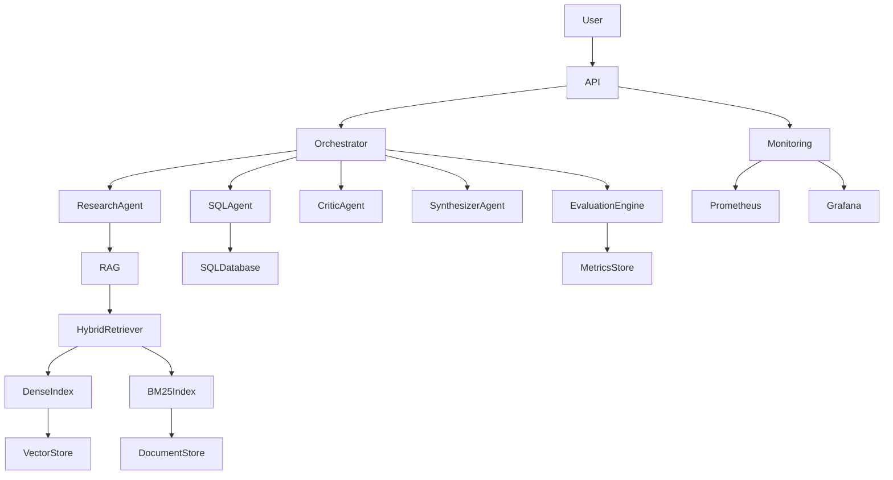
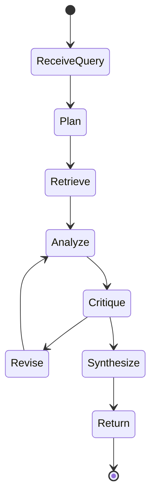
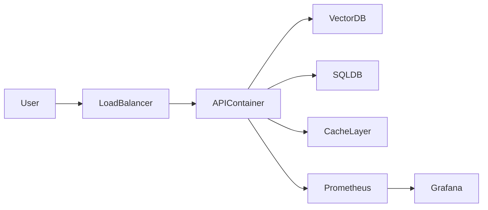

# System Architecture Diagrams

## High-Level Architecture

```mermaid
flowchart TD
User --> API
API --> Orchestrator
Orchestrator --> ResearchAgent
Orchestrator --> SQLAgent
Orchestrator --> CriticAgent
Orchestrator --> SynthesizerAgent
ResearchAgent --> RAG
SQLAgent --> SQLDatabase
RAG --> HybridRetriever
HybridRetriever --> DenseIndex
HybridRetriever --> BM25Index
DenseIndex --> VectorStore
BM25Index --> DocumentStore
Orchestrator --> EvaluationEngine
EvaluationEngine --> MetricsStore
API --> Monitoring
Monitoring --> Prometheus
Monitoring --> Grafana
```

## Agent State Flow

```mermaid
stateDiagram-v2
[*] --> ReceiveQuery
ReceiveQuery --> Plan
Plan --> Retrieve
Retrieve --> Analyze
Analyze --> Critique
Critique --> Revise
Revise --> Analyze
Critique --> Synthesize
Synthesize --> Return
Return --> [*]
```

## Deployment Architecture

```mermaid
flowchart LR
User --> LoadBalancer
LoadBalancer --> APIContainer
APIContainer --> VectorDB
APIContainer --> SQLDB
APIContainer --> CacheLayer
APIContainer --> Prometheus
Prometheus --> Grafana
```
